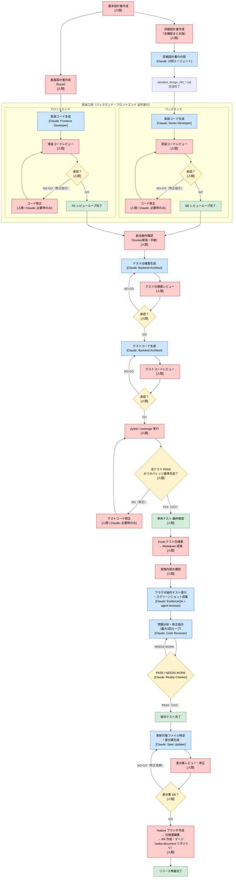

# 開発プロセス フロー図

## 凡例

| 色 | 担当 |
|---|---|
| 🔴 赤 | 人間 |
| 🔵 青 | Claude エージェント |
| 🟡 黄 | 品質ゲート（GO / NO-GO 判定） |
| 🟢 緑 | 工程完了マイルストーン |

---

## フロー図

```mermaid
flowchart TD
    %% ===== 設計工程 =====
    A1["基本設計書作成\n[人間]"] --> A2["詳細設計書作成\n（全機能まとめ版）\n[人間]"]
    A1 --> A3["画面設計書作成\n（Excel）\n[人間]"]
    A2 --> A4["詳細設計書の分割\n[Claude: 分割エージェント]"]
    A4 --> A5["detailed_design_NN_*.md\n生成完了"]

    %% ===== 実装工程（並列） =====
    A5 --> B1
    A3 --> C1

    subgraph IMPL ["実装工程（バックエンド・フロントエンド 並列実行）"]
        direction TB
        subgraph BE ["バックエンド"]
            B1["実装コード生成\n[Claude: Senior Developer]"]
            B2["実装コードレビュー\n[人間]"]
            B3{"承認？\n[人間]"}
            B4["コード修正\n[人間 / Claude: 必要時のみ]"]
            B1 --> B2 --> B3
            B3 -- "NO-GO（修正指示）" --> B4 --> B2
            B3 -- "GO" --> B5["BE レビューループ完了"]
        end
        subgraph FE ["フロントエンド"]
            C1["実装コード生成\n[Claude: Frontend Developer]"]
            C2["実装コードレビュー\n[人間]"]
            C3{"承認？\n[人間]"}
            C4["コード修正\n[人間 / Claude: 必要時のみ]"]
            C1 --> C2 --> C3
            C3 -- "NO-GO（修正指示）" --> C4 --> C2
            C3 -- "GO" --> C5["FE レビューループ完了"]
        end
    end

    B5 --> D1
    C5 --> D1
    D1["結合動作確認\n（Docker環境・手動）\n[人間]"]

    %% ===== 単体テスト工程 =====
    D1 --> E1["テスト仕様書生成\n[Claude: Backend Architect]"]
    E1 --> E2["テスト仕様書レビュー\n[人間]"]
    E2 --> E3{"承認？\n[人間]"}
    E3 -- "NO-GO" --> E1
    E3 -- "GO" --> E4["テストコード生成\n[Claude: Backend Architect]"]
    E4 --> E5["テストコードレビュー\n[人間]"]
    E5 --> E6{"承認？\n[人間]"}
    E6 -- "NO-GO" --> E4
    E6 -- "GO" --> E7["pytest / coverage 実行\n[人間]"]
    E7 --> E8{"全テスト PASS\nかつカバレッジ基準充足？\n[人間]"}
    E8 -- "NO（修正）" --> E9["テストコード修正\n[人間 / Claude: 必要時のみ]"]
    E9 --> E7
    E8 -- "YES（GO）" --> E10["単体テスト 最終確認\n[人間]"]

    %% ===== 結合テスト工程 =====
    E10 --> F1["Excel テスト仕様書\n→ Markdown 変換\n[人間]"]
    F1 --> F2["変換内容の確認\n[人間]"]
    F2 --> F3["ブラウザ操作テスト実行\n・スクリーンショット収集\n[Claude: EvidenceQA + agent-browser]"]
    F3 --> F4["問題分析・修正指示\n（最大3回ループ）\n[Claude: Code Reviewer]"]
    F4 --> F5{"PASS / NEEDS WORK\n[Claude: Reality Checker]"}
    F5 -- "NEEDS WORK" --> F4
    F5 -- "PASS（GO）" --> F6["結合テスト完了"]

    %% ===== 機能仕様書更新工程 =====
    F6 --> G1["更新対象ファイル特定\n・差分案生成\n[Claude: Spec Updater]"]
    G1 --> G2["差分案レビュー・修正\n[人間]"]
    G2 --> G3{"差分案 OK？\n[人間]"}
    G3 -- "NO-GO（修正依頼）" --> G1
    G3 -- "GO" --> G4["feature ブランチ作成\n→ 仕様書編集\n→ PR 作成・マージ\n（weko-document リポジトリ）\n[人間]"]
    G4 --> G5["リリース準備完了"]

    %% ===== スタイル =====
    classDef human fill:#ffcccc,stroke:#cc0000,color:#000
    classDef agent fill:#cce5ff,stroke:#0055cc,color:#000
    classDef gate fill:#fff3cd,stroke:#cc8800,color:#000
    classDef endpoint fill:#d4edda,stroke:#1a7a2e,color:#000

    class A1,A2,A3,B2,B4,C2,C4,D1,E2,E5,E7,E9,E10,F1,F2,G2,G4 human
    class A4,B1,C1,E1,E4,F3,F4,G1 agent
    class B3,C3,E3,E6,E8,F5,G3 gate
    class B5,C5,E10,F6,G5 endpoint
```

---
